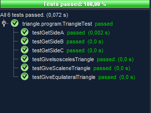

1. **Recap book chapter 1 – 2 (1 SP – 55% must be passed)**

Answered on Moodle.

2. **Static Code Analysis of Triangle program (4 SP)**
    
    a) DONE  
    b) DONE  
    c) Here is some metrics from my triangle program:

    

    d) It is hard to calculate because i am not using any booleans or cases.  
    e and f) Wrote some different unit cases. Here is a snippet:
    
    

3. **Peer Review Checklist (2 SP)**

    Smartbear gives a 12-step list with advises on how to do better code review. Here they say that if the author (programmer) did annotations on his/her code, then it will cause in fewer defects.

    Creating transparent goals can also help improving. 

    If you have a system to capture metrics it can improve your processes.

    They recommend not to use more than 60 minutes on a review. This one I think is important. I know from my work that if one of the other developers has a pullrequest with 2000 lines of code, then it will be almost impossible to review all this in one row.
    
    This also leads to the next step where they advise not to review more than 200 lines of code in one sitting. So in my example I would have used 10 sittings with the 2000 lines of code.

    And here again they advise to take a 20 minute break between review sessions. I thik this is important to do, because you will find more defects when you are clear in your head.

    They also advise code reviewing to be a team building activity. 

    Do a certain amount of code review every day. Here I think that they want the developers to review their own code each day?

    Using a code review tool will optimize the time spent on code reviews. 

    And last, they recommend using they list when doing code reviews.

4. **Review code that mysteriously fails its unit tests (1 SP)**

    I'm having a hard time here to see what the problem is? Is it the use of some types that isn't allowed?

5. **Coding Standard Document (1 SP)**

    When it comes to coding standards, there are many thing I find important to follow. If every developer in the team are making different writing styles and rules, then it will be a mess to review. Some importing things could be:
    Naming conventions. By naming conventions I mean some rules around naming. Ex. are the team using PascalCasing or camelCasing for variable, class and method names. I also find it very important to make use of variable types if possible. By variable types I mean like string, int, double, boolean ect. because it will be safer and easier to test. For the visual I also think it is important to make “air” between blocks of code so you easily can abstract from other code. 
    A thing that I think is done to little is commenting the code developers make. People always say that the code is self-understandable, but still I think it will be more easy to understand if code comments are made. 
    Also, do not make long complex methods. If the method gets to long, then split it up to more methods. This will also be easier for other developers to understand the methods if they are not long and that complex. This will also make the program more loosely coupled. 

    If all of these standards are followed, then it will be much more easier to write tests for the project (if it makes sense in your project)

6. **Highlights from lecture by Gitte Ottosen, Gapgemini-Sogeti (1 SP)**
    
    Unfortunately I was ill the day Gitte was there.
